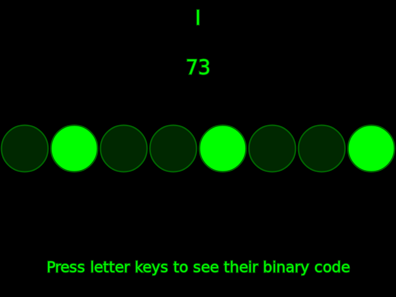

# ASCII to Binary visualization

Based on the video [Coding Challenge #119: Binary to Decimal Conversion](https://thecodingtrain.com/CodingChallenges/119-binary-decimal-conversion.html)

[See it live running here.](https://doxanthropos.github.io/sketchbook/2018102301/)

If you want to learn more about binary, bits, bytes, and character encoding, these blog posts by [Vaidehi Joshi](https://medium.com/@vaidehijoshi) are worth a read:

* [Bits, Bytes, Building With Binary](https://medium.com/basecs/bits-bytes-building-with-binary-13cb4289aafa)
* [Hexes and Other Magical Numbers](https://medium.com/basecs/hexs-and-other-magical-numbers-9785bc26b7ee)

Or if you are more the acustic type, you might want to listen to the first season of the [BaseCS-Podcast](https://www.codenewbie.org/basecs).
